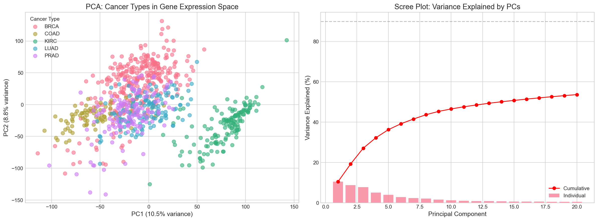
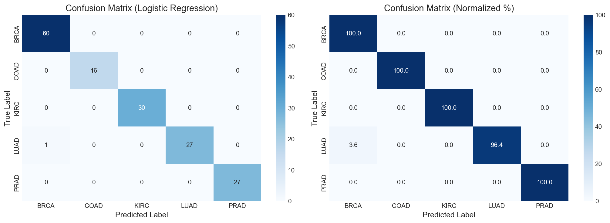
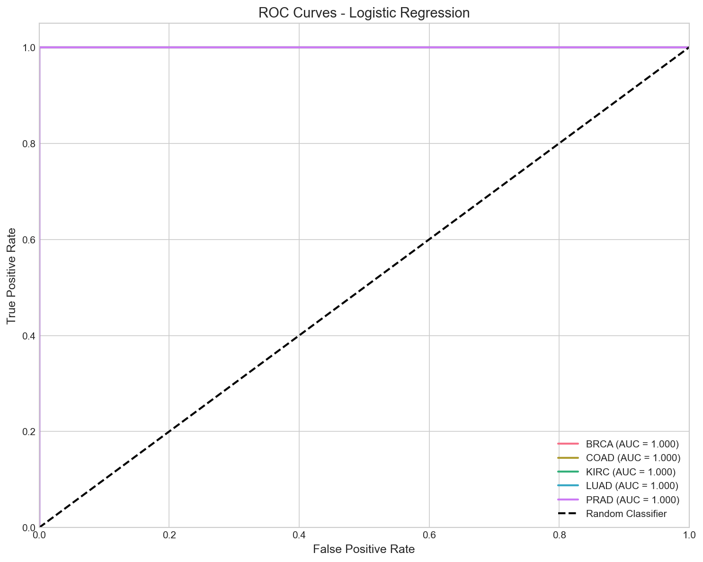
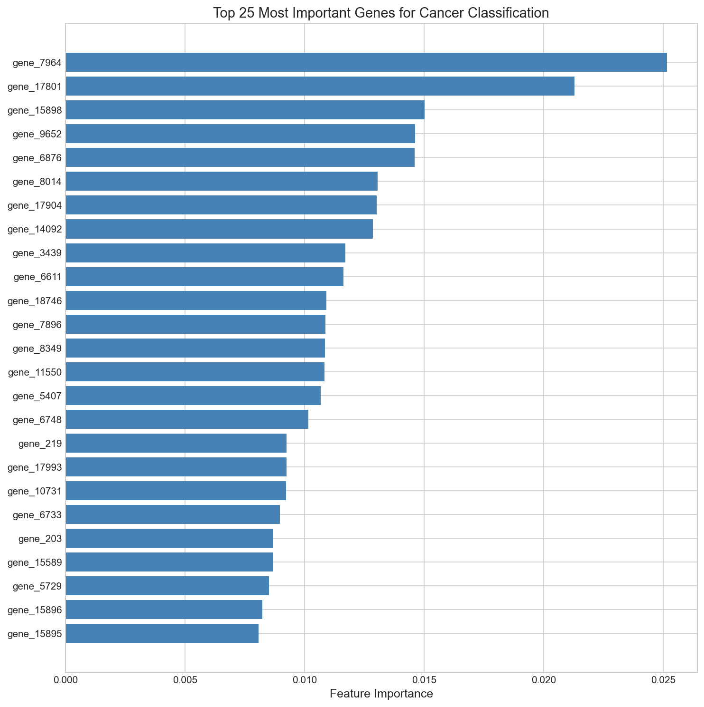

# TCGA Pan-Cancer Classification using Machine Learning

A machine learning project to classify cancer types from gene expression data using The Cancer Genome Atlas (TCGA) dataset.

## Project Overview

This project demonstrates the application of machine learning techniques to classify tumor samples into their cancer type of origin based on RNA-seq gene expression profiles. This is a classic problem in computational biology with applications in cancer diagnosis and understanding tumor biology.

## Dataset

- **Source**: The Cancer Genome Atlas (TCGA) Pan-Cancer dataset via UCI ML Repository
- **Samples**: 801 tumor samples across 5 cancer types
- **Features**: 20,531 gene expression values (RNA-seq, normalized)
- **Task**: Multi-class classification of cancer types

### Cancer Types
| Code | Full Name | Organ | Samples |
|------|-----------|-------|---------|
| BRCA | Breast Invasive Carcinoma | Breast | 300 |
| KIRC | Kidney Renal Clear Cell Carcinoma | Kidney | 146 |
| LUAD | Lung Adenocarcinoma | Lung | 141 |
| PRAD | Prostate Adenocarcinoma | Prostate | 136 |
| COAD | Colon Adenocarcinoma | Colon | 78 |

## Methods

### Preprocessing
- Train/test split: 80/20 stratified (640 train, 161 test)
- Variance filtering: Removed 50% lowest variance genes (20,531 → 10,265)
- SelectKBest: Top 1,000 genes by ANOVA F-score
- Feature scaling: StandardScaler (mean=0, std=1)

### Models Evaluated
- Logistic Regression (multinomial)
- Random Forest Classifier (200 trees)
- Support Vector Machine (RBF kernel)

### Evaluation Metrics
- Accuracy, Precision, Recall, F1-score
- Confusion matrix
- ROC-AUC (one-vs-rest)

## Project Structure

```
tcga-cancer-classification/
├── data/
│   ├── raw/              # Original downloaded data
│   └── processed/        # Cleaned and preprocessed data
├── notebooks/
│   ├── 01_data_exploration.ipynb
│   ├── 02_preprocessing.ipynb
│   └── 03_model_training.ipynb
├── src/
│   ├── data_loader.py
│   ├── preprocessing.py
│   └── models.py
├── results/
│   └── figures/          # Generated plots and visualizations
├── models/               # Saved trained models
├── environment.yml       # Conda environment
├── requirements.txt      # Python dependencies
└── README.md
```

## Installation

### Using Conda (Recommended)
```bash
conda env create -f environment.yml
conda activate tcga-cancer
```

### Using pip
```bash
pip install -r requirements.txt
```

## Usage

1. Clone the repository
2. Set up the environment (see Installation)
3. Run the notebooks in order:
   - `01_data_exploration.ipynb` - Explore the dataset
   - `02_preprocessing.ipynb` - Data cleaning and feature engineering
   - `03_model_training.ipynb` - Train and evaluate models

## Results

### Model Performance

| Model | CV Accuracy (5-fold) | Test Accuracy | ROC-AUC |
|-------|---------------------|---------------|---------|
| **Logistic Regression** | **99.84%** | **99.38%** | **1.000** |
| Random Forest | 99.69% | 98.76% | 1.000 |
| SVM (RBF) | 99.69% | 99.38% | 1.000 |

**Best Model: Logistic Regression** with 99.38% test accuracy

### Per-Class Performance (Best Model)

| Cancer Type | Precision | Recall | F1-Score |
|-------------|-----------|--------|----------|
| BRCA (Breast) | 0.98 | 1.00 | 0.99 |
| COAD (Colon) | 1.00 | 1.00 | 1.00 |
| KIRC (Kidney) | 1.00 | 1.00 | 1.00 |
| LUAD (Lung) | 1.00 | 0.96 | 0.98 |
| PRAD (Prostate) | 1.00 | 1.00 | 1.00 |

### Visualizations

#### PCA: Cancer Types in Gene Expression Space


#### Confusion Matrix


#### ROC Curves


#### Feature Importance


## Key Findings

1. **High Classification Accuracy**: Gene expression profiles can distinguish cancer types with >99% accuracy, demonstrating distinct molecular signatures for each cancer.

2. **Robust Results**: All three models achieved similar performance, indicating the signal is strong and results are not model-dependent.

3. **Clear Biological Separation**: PCA visualization shows distinct clusters for each cancer type, with kidney cancer (KIRC) showing the most distinct expression profile.

4. **Interpretable Features**: The top predictive genes identified by Random Forest feature importance could represent biologically meaningful cancer markers.

5. **Clinical Relevance**: This type of classifier could assist in cancer diagnosis, particularly for tumors of unknown primary origin.

## Technologies Used

- **Python 3.10**
- **scikit-learn** - Machine learning (Logistic Regression, Random Forest, SVM)
- **pandas, numpy** - Data manipulation
- **matplotlib, seaborn** - Visualization

## Quick Start

```bash
# Clone the repository
git clone https://github.com/YOUR_USERNAME/tcga-cancer-classification.git
cd tcga-cancer-classification

# Create environment
conda env create -f environment.yml
conda activate tcga-cancer

# Run the analysis
python run_exploration.py      # Data exploration
python run_preprocessing.py    # Feature selection
python run_training.py         # Model training
```

## References

1. The Cancer Genome Atlas Research Network. (2013). The Cancer Genome Atlas Pan-Cancer analysis project. *Nature Genetics*.
2. Hoadley, K. A., et al. (2018). Cell-of-Origin Patterns Dominate the Molecular Classification of 10,000 Tumors from 33 Types of Cancer. *Cell*.
3. UCI Machine Learning Repository - TCGA Pan-Cancer Dataset

## Author

Amogh

## License

This project is for educational purposes. TCGA data is publicly available for research use.
